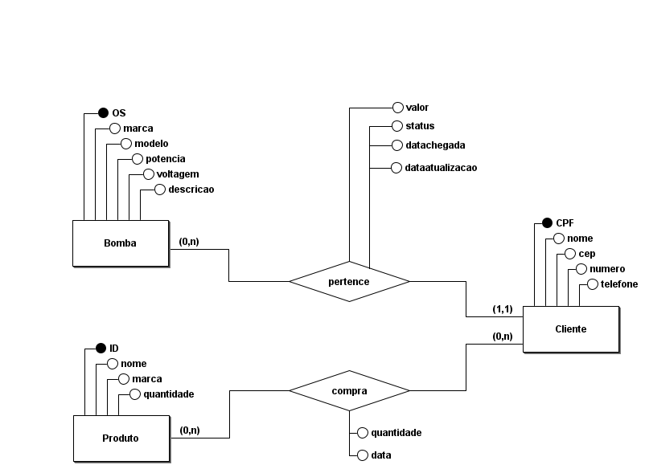
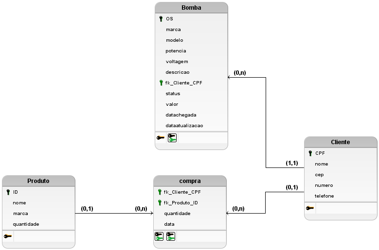
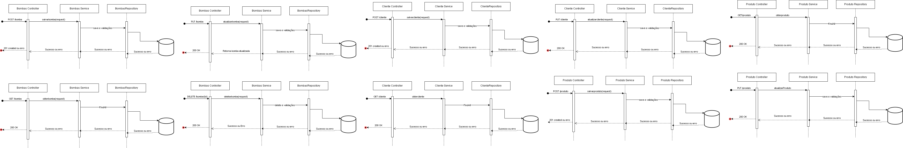

# brasbombasAPI
Interface para o gerenciamento do banco de dados.
A descrição do trabalho e as instruções para execução da aplicação devem ser 
inseridas no arquivo README.md. 
• Todos os arquivos, esquemas/diagramas e demais informações sobre a solução 
desenvolvida devem ser incluídos no repositório do GitHub. 

Diagrama conceitual e Diagrama lógico
  
 
 
